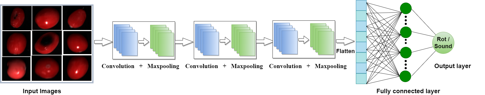

# CARP
Accurately Identifying Sound vs Rotten Cranberries Using Convolutional Neural Network

### [1]. Abstract

Cranberries, native to North America, are known for their nutritional value and human
health benefits. One hurdle to commercial production is losses due to fruit rot.
Cranberry fruit rot results from a complex of more than ten filamentous fungi,
challenging breeding for resistance. Nonetheless, our collaborative breeding program
has fruit rot resistance as a significant target. This program currently relies heavily on
manual sorting of sound vs. rotten cranberries. This process is labor-intensive and time-
consuming, prompting the need for an automated classification (sound vs. rotten)
system. Although many studies have focused on classifying different fruits and
vegetables, no such approach has been developed for cranberries yet because of the
lack of datasets for conducting the necessary image analyses. This research addresses
this gap by introducing a novel image dataset comprising sound and rotten cranberries
to facilitate computational analysis. In addition, we developed CARP (Cranberry
Assessment for Rot Prediction), a Convolutional Neural Network (CNN) based model to
distinguish sound cranberries from rotten ones. With an accuracy of 97.4%, a
sensitivity of 97.2%, and a specificity of 97.2% on the training dataset and 94.8%,
95.4%, and 92.7% on the independent dataset, respectively, our proposed CNN model
shows its effectiveness in accurately differentiating between sound and rotten
cranberries.

### [2]. Model Architecture:

Model architecture of CARP (Cranberry Assessment for Rot Prediction)


### [3]. How to Run Package:

#### [3.1] Test Command-line #1: Run on a single data
```console
user@machine:~$ python main.py -fp 'file_path'
```

**Table 3:**  command line element
| Symbol  | Explanation  |
| ------- | ------------ |
| -fp | file path with .png format  | 
